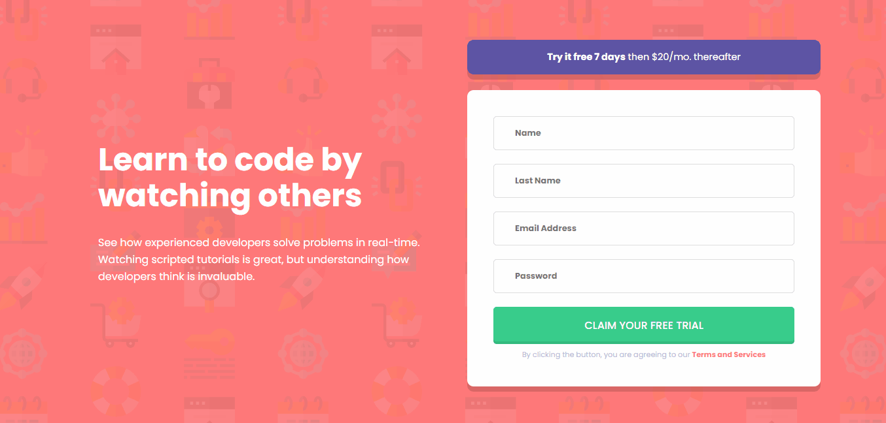

<h1 align="center">
  <a href="">
    Signup desafio
  </a>
</h1>

<b>Signup</b> desenvolvido com HTML, SASS E Javascript, uma aplicação dinâmica fazendo a validação dos campos!

   
  
  

  

  

  

  

Um desafio onde foi preciso utilizar HTML, CSS e Javacript para desenvolver um signup responsivo e o mais próximo possível do design, tendo também a válidação dos campos enviados. 🚀🚀🚀

